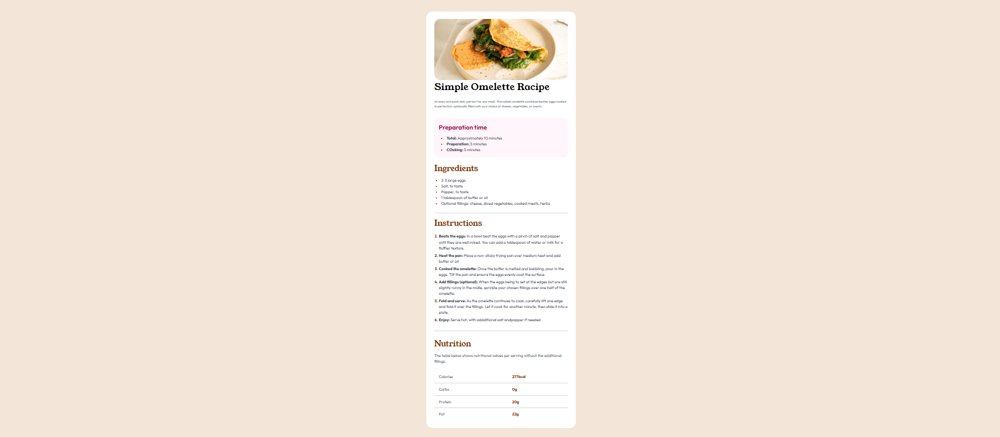
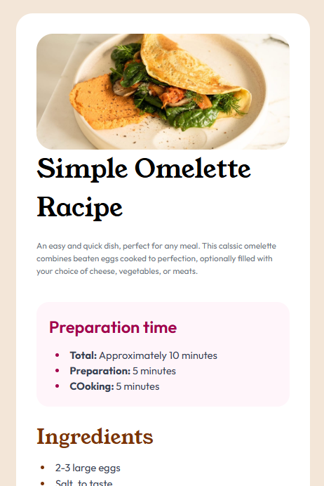

# Frontend Mentor - Recipe page solution

This is a solution to the [Recipe page challenge on Frontend Mentor](https://www.frontendmentor.io/challenges/recipe-page-KiTsR8s60o).

## Table of contents

- [Overview](#overview)
  - [Screenshots](#screenshots)
  - [Links](#links)
- [My process](#my-process)
  - [Built with](#built-with)
- [Author](#author)

## Overview

### Screenshots

### - Desktop View(zoomed out)

### - Mobile View

### Links

- Solution URL: [https://github.com/nu-amzad/racipe-page-frontendmentor-project](https://github.com/nu-amzad/racipe-page-frontendmentor-project)
- Live Site URL: [https://racipe-page-frontendmentor.netlify.app/](https://racipe-page-frontendmentor.netlify.app/)

## My process

### Built with

- Semantic HTML5 markup
- HTML Table for nutrition data
- Mobile-first workflow
- [Tailwind CSS](https://tailwindcss.com/) - Styling
- [Vite](https://vitejs.dev/) - Development Tool
- Google Fonts (Outfit & Young Serif)

### Key Challenge
The hardest part of this project was working with the `<table>` tag. Customizing the borders and padding for the nutrition section required specific Tailwind utility classes to ensure the table looked clean and aligned perfectly with the rest of the content.

## Author

- Frontend Mentor - [@nu-amzad](https://www.frontendmentor.io/profile/nu-amzad)